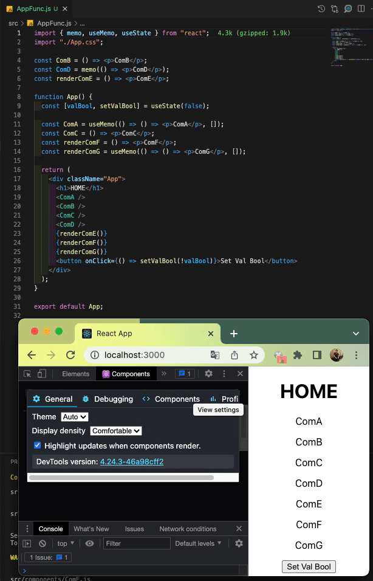
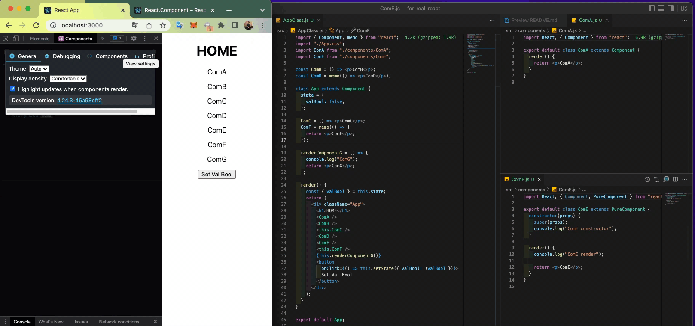

# React rendering `Function Component` vs `Class Component`

This repository created for POC about `rendering` of react. I try to prove because I was curious about behavior of react.

# Goal

- Try create multiple component type
- Click button for check rendering
- Use [React Developer Tools](https://chrome.google.com/webstore/detail/react-developer-tools/fmkadmapgofadopljbjfkapdkoienihi) for check rendering

# #Function Component

file [here](src/AppFunc.js)

## Re-render

- `ComA` is Component using `useMemo()`
- `ComB` is Component out of scope `<App />`

## Not re-render

- `ComC` is Component in of scope `<App />`
- `ComD` is Component out of scope `<App />`
  and using `memo()`
- `ComE` is function return Component out of scope `<App />`
- `ComF` is function return Component in of scope `<App />`
- `ComG` is function return Component in of scope `<App />` and using `useMemo()`

## Demo Function Component

# #Class Component

file [here](src/AppClass.js)

## Re-render

- `ComA` is Class Component out of scope `<App />`
- `ComB` is Funciton Component out of scope `<App />`
- `ComC` is Funciton Component in of scope `<App />`

## Not re-render

- `ComD` is Funciton Component out of scope `<App />`
  and using `memo()`
- `ComE` is Class Component out of scope `<App />` extends `PureComponent`
- `ComF` is Funciton Component in of scope `<App />` using `memo()`
- `ComG` is function return Component in of scope `<App />` 

## Demo Class Component

